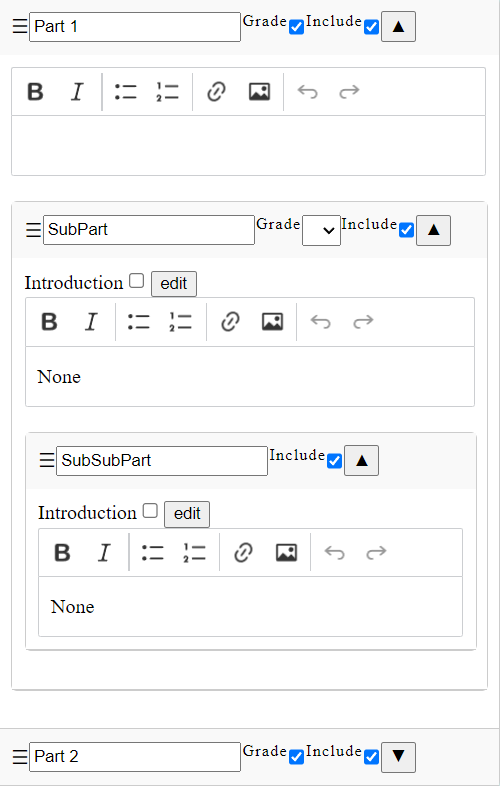

# Graded Report Formatter
## About the project
This project is a text-editing web-application. The objective is to allow the creation of similar reports with a minimum amount of time using detailed templates, while keeping the report as editable as possible. A key feature of the application is to allow graded parts in the reports. Each subpart will then have a grade displayed, and a conclusion graph will be added to the report.

## Getting Started
This project is written in python using the framework Django. It requires a python version of 3.8 of higher. The required python modules are listed in the [requirements.txt](requirements.txt) file. To install them all, open a terminal in the root of the project, then execute the following command :
```
pip install -r requirements.txt
```
The database of the application needs to be created. To do so, exectue in the same terminal :
```
python manage.py migrate
```
Finally, to run the application locally, execute :
```
python manage.py runserver
```
By default, the application is running locally on port 8000. The home page can be accessed at [http://127.0.0.1:8000/grf/](http://127.0.0.1:8000/grf/).

## Application description
The application is composed of 3 main pages :
1. Home page : navigate to any report or template, and create a new report or a template. When a report is created, a template to initialize the report from should be selected.
1. Report editing : edit the selected report, a save button and two export buttons (to PDF and to Word).
1. Template editing, similar to report editing without export options.

